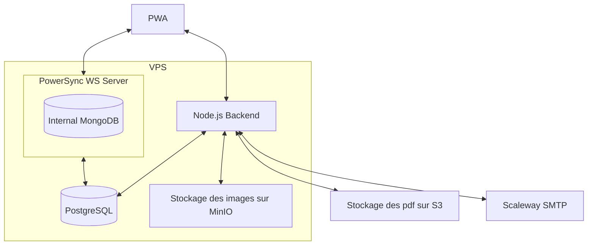

# Installation

### Prérequis:

- node >= 20
- pnpm = 8.4.0

### Utilisation

- `pnpm install`
- Copy `.env.dist` to `.env` and fill the variables
- `docker compose up -d`
- `pnpm migration:up`
- `pnpm backend dev`
- `pnpm frontend dev`

La whitelist n'est pas active dans l'environnement de développement

# Découverte du service, premiers pas

// TODO quand les pages "Mon UDAP" et "Mon compte" seront livrées

# Infrastructure

# Framework et dépendances

## Architecture du repo

L'application est un monorepo pnpm séparé en 3 packages

- `backend` qui est une application NodeTS reponsable de l'authentification, du CRUD sur la base de données, ainsi que
  de la génération du pdf
- `frontend` qui est une PWA conçue avec Vite et ReactTS
- `pdf` qui contient la logique partagée entre les 2 précédents packages

## Base de données et synchronisation

L'application utilise une base de données Postgres, définie par la variable `DATABASE_URL` dans le fichier `.env`. Pour
effectuer des requêtes, le frontend et le backend utilisent `kysely`.

### Synchronisation

L'application utilise le service [PowerSync](https://docs.powersync.com/intro/powersync-overview) comme moteur de
synchronisation. Il est composé :

- d'un serveur WebSocket connecté à un replica de la base de données
- d'une base de données Mongo interne (qui n'a pas besoin d'être persistente)

Le workflow est le suivant :

- Les règles d'accès au données sont définies dans le fichier `powersync-config.yaml`
- Le frontend se connecte via WebSocket et reçoit les données auxquelles il a accès, ainsi que leurs modifications en
  temps réel, et les stocke dans une base de données IndexedDB
- L'utilisateur modifie ses données locales
- Le frontend envoie les données au backend via une requête POST, qui applique les modifications sur la base de données
- Le service PowerSync est notifié grâce au replica, et diffuse ces modifications à tous les utilisateurs concernés

### Migrations

Les migrations sont écrites en SQL et placées dans le dossier `db/migrations`.

Elles sont exécutées grâce à la commande `pnpm migration:up`, qui utilise le package
[@databases/pg-migrations](https://www.npmjs.com/package/@databases/pg-migrations).

### Types Typescript

Après avoir effectué des migrations, `pnpm backend pull-types` génère les types typescript dans le fichier
[db-types.d.ts](./packages/backend/src/db-types.d.ts)

## API

Le routeur est défini avec `fastify` et les requêtes sont validées avec `typebox`.

Le RPC se génère grâce à la commande `pnpm client:generate`, qui

- génére le fichier `openapi.json` grâce à [`@fastify/swagger`](https://github.com/fastify/fastify-swagger)
- génére le fichier `api.ts` grâce à [`typed-openapi`](https://github.com/astahmer/typed-openapi)

# Scripts

- `clearDb.sh` clears local postgres db
- `frontend/createEnvFile.ts` used in prod to inject env vars starting with VITE\_ at runtime
- `frontend/generatePandaDS.ts` used in dev to generate [PandaCSS](https://panda-css.com/docs/theming/tokens) tokens
  from [DSFR](https://github.com/GouvernementFR/dsfr)
