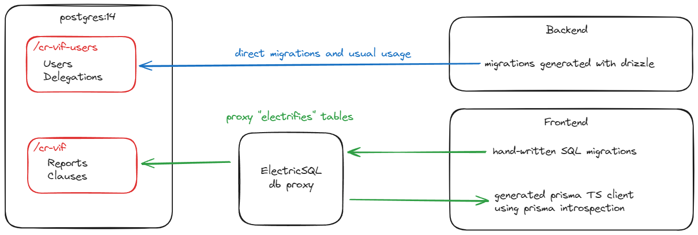

# DB Workflow

This app contains 2 databases on a single Postgres container, and a database proxy.

## Live data

#### ElectricSQL allows users to be notified when data changes.

To achieve this, every table containing "live" value must be created through the ElectricSQL proxy, with

```sql
ALTER TABLE table ENABLE ELECTRIC;
```

Electric Data is stored in the /cr-vif database of the Postgres container.

TS client can be generated with `electric-sql generate`, which uses
[prisma introspection](https://www.prisma.io/docs/orm/prisma-schema/introspection). It can be used in browser and/or
Node.

## Non-synchronized data

Non-synchronized data is stored in the /cr-vif-users database of the Postgres container.

## Migrations

### Electric

- Write migrations in `db/migrations/` and electrify tables using `ALTER TABLE table ENABLE ELECTRIC;`
- `pnpm migrate:electric` applys migrations to the proxy db and generate the TS client in
  `./packages/frontend/src/generated`

### Users

- Edit `./packages/backend/src/db/schema.ts`
- `pnpm migrate:users` generates migrations files in `./backend/drizzle`
- Migrations are applied when the backend starts


