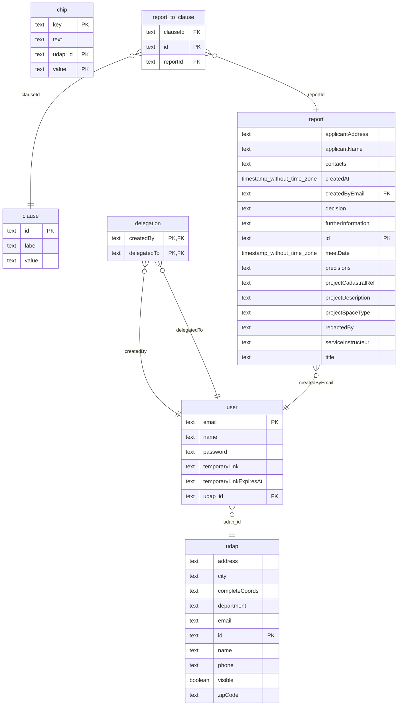

# Monorepo architecture

This app is divided in multiple packages :

- `backend` is responsible for the user authentication, pdf generation and some static data serving
- `frontend` contains the main app logic

# DB Workflow



## Live data

#### PowerSync allows users to be notified when data changes.

To achieve this, every table containing live values must be part of the "powersync" publication.

```sql
ALTER PUBLICATION powersync ADD TABLE "table";
```

[PowerSync documentation](https://docs.powersync.com/intro/powersync-overview)

## Migrations

- Write SQL migrations in `db/migrations/`
- `pnpm migration:up`

# DB Clients

- Both packages use [Kysely](https://kysely.dev/)
- `pnpm backend pull-types` generated a single .d.ts file describing the database structure
- `frontend/src/db/AppSchema.ts` contains the schema that will be used against indexed-db
  > It is quite similar to the generated .d.ts file except it uses SQLite types (so TIMESTAMP or JSONB becomes TEXT)

# Scripts

- `clearDb.sh` clears postgres db
- `frontend/createEnvFile.ts` used in prod to inject env vars starting with VITE\_ at runtime
- `frontend/generatePandaDS.ts` used in dev to generate [PandaCSS](https://panda-css.com/docs/theming/tokens) tokens
  from [DSFR](https://github.com/GouvernementFR/dsfr)
