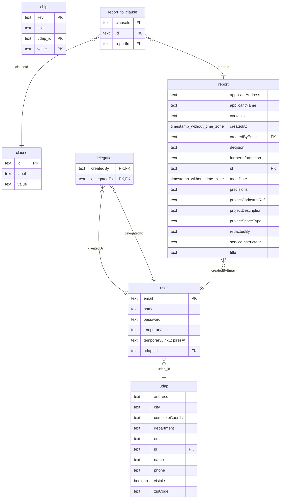

# Monorepo architecture

This app is divided in multiple packages :

- `backend` is responsible for the user authentication, pdf generation and some static data serving
- `frontend` contains the main app logic
- `electric-client` is responsible for generating typescript clients listed down below
  > This package exports .ts files, this means each app using this package will build it using its own rules

# DB Workflow



## Live data

#### ElectricSQL allows users to be notified when data changes.

To achieve this, every table containing "live" values must be created through the ElectricSQL proxy, with

```sql
ALTER TABLE table ENABLE ELECTRIC;
```

[Electric SQL documentation](https://electric-sql.com/docs)

## Migrations

- Write migrations in `db/migrations/` and electrify tables using `ALTER TABLE table ENABLE ELECTRIC;`
- `pnpm electric:migrate` applys migrations to the proxy db and generate the clients described below

# Clients

Multiple clients are needed for this app to work :

**They all are generated automatically when applying migrations**

- An electric db client used by frontend to query from indexedDB and sync.

  > You can generate it using `pnpm electric-client generate:front`

- A Prisma db client used by backend to query from Postgres
  > You can generate it using `pnpm electric-client generate:back`
- An API client generated using `@fastify/swagger` and `typed-openapi`, used by the frontend to query the backend
  > You can generate it using `pnpm client:generate`

# Scripts

- `clearDb.sh` clears postgres db
- `frontend/createEnvFile.ts` used in prod to inject env vars starting with VITE\_ at runtime
- `frontend/generatePandaDS.ts` used in dev to generate [PandaCSS](https://panda-css.com/docs/theming/tokens) tokens
  from [DSFR](https://github.com/GouvernementFR/dsfr)
- `electric-client/completePrismaClient.ts` resolves an issue with prisma not being properly typed
